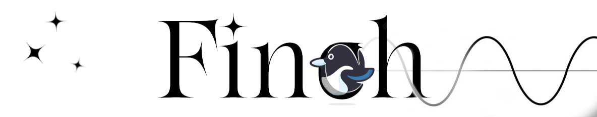

# FINCH (v2.0.2)

<p align="center">
  
</p>

## Contact Me

If you have any problem, please contact me at:

michael.cretignier@physics.ox.ac.uk

## Description

Finch is a Python package to fit the stellar magnetic cycle periods on activity proxies' time series.
The code is fast and outlier-robust in order to deliver a period and its related uncertainty in a few seconds.

https://github.com/MichaelCretignier/FINCH

## Installation

Download the directory and try to run the minimal example ```example.py``` with your own Python installation.
If it crashes, install a Python environment:

 [Mac M4 Chip] Python environment (Conda install) (Python 3.12.5)

```
[TERMINAL]
conda create -n finch -c conda-forge python=3.12.5 numpy=1.26.4 pandas=2.3.2 scipy=1.16.2 matplotlib=3.10.6 ipython=9.5.0 colorama=0.4.6 scikit-learn=1.7.2 -y 
```

—————————————
REQUIREMENT :
—————————————

Standard python libraries for Python 3.12.5 : 

numpy (1.26.4) \
scipy (1.16.2) \
matplotlib (3.10.6) \
pandas (2.3.2) \
colorama (0.4.6) \
ipython (9.5.0) \
scikit-learn (1.7.2)

## Test minimal example

Move inside the directory and launch an ipython shell:

```
[TERMINAL]
conda activate finch
cd .../GitHub/FINCH
ipython
```

Then run the example using the matplotlib magic:

```
[IPYTHON]
%matplotlib
run example.py
```


## FINCH file format

Finch input tables are typical .csv files containing at minimum 6 columns: 

1) jdb (jdb - 2,400,000)
2) proxy (MHK in %)
3) proxy uncertainties 
4) instrument (spectrograph) 
5) reference (sources) 
6) flag (binary)

flag=1 data are rejected of FINCH analysis, but preserved in the plots

## Citations

Even if Finch has never been properly presented in a paper, since this method was initially a standard analysis of the YARARA pipeline of Cretignier et al., 2021 paper, please cite it as a "publicly available function of the YARARA pipeline".

ADS Link : https://ui.adsabs.harvard.edu/abs/2021A%26A...653A..43C/abstract

## Details Description of the Algorithm

FINCH concat over different sources/references, but keep traces of the instruments for the offsets. 

The magnetic cycle model is a simple sinusoids that includes polynomial drift and instrumental offsets.

Uncertainties are derived using intra-season jitter (induced by the instrumental noise and stellar rotation).

The code estimates the uncertainties on all the parameters by bootstrap using the advantage of the simple multilinear model optimized via a least-square matrix inversion. 

The code contains an automatic mode that compares different pre-registered models and selects the one producing the sharpest likelihood. 

A Gaussian-Process can then be run using as initial guess the output of the previous fit ensuring stability. 
