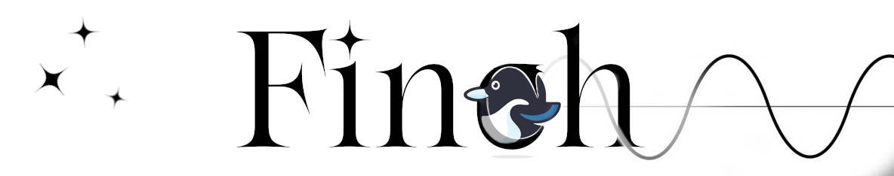

# FINCH (v2.1.1)

<p align="center">
  
</p>

FINCH is a Python package designed to fit stellar magnetic cycle periods from activity proxy time series.
The code is fast and robust to outliers, delivering a period estimate and its associated uncertainty within a few seconds.

https://github.com/MichaelCretignier/FINCH

## ⓵ Contact Me

If you encounter any issues, please contact me at:

michael.cretignier@physics.ox.ac.uk

## ⓶ Installation (pip install) 

*(This feature will soon be available... Install by [Git Clone](#flag1) for now)*

<!--
Using conda:

```bash
conda create -n finch python=3.12.5
conda activate finch
pip install finch
```
 -->

## ⓷ Installation (Git Clone)

<a id="flag1"></a>

*Git Clone / Download this GitHub repository on your own machine and move in the directory.*

```bash
cd .../GitHub/FINCH/
```

*Try to run the minimal example `...FINCH/example.py` with your own Python installation.\
If it crashes, install a Python environment as below:*

### [Option 1] Conda install

#### Mac M4 Chip (Python 3.12.5)

```bash
conda create -n finch -c conda-forge python=3.12.5 numpy=1.26.4 pandas=2.3.2 scipy=1.16.2 matplotlib=3.10.6 ipython=9.5.0 colorama=0.4.6 scikit-learn=1.7.2 -y 

```

#### Mac Intel Chip (Python 3.8.8)

```bash
conda create -n finch -c conda-forge python=3.8.8 numpy=1.23.5 pandas=1.4.1 scipy=1.8 matplotlib=3.5 ipython=7.22.0 colorama=0.4.4 scikit-learn=0.24.1 -y 
```

*Then activate the `finch` environment:*

```bash
conda activate finch
```

*Check if the finch environment exists and is active:*

```bash
conda env list
```

### [Option 2] Venv install

*(Be sure to have install Python 3.12.5 on your own)*

```bash
python3 -m venv finch
source finch/bin/activate 
pip install --upgrade pip 
pip install -r requirements_3.12.5.txt
```

## ⓸ Test minimal example

Move inside the `..GitHub/FINCH/` directory and launch an IPython shell:

```bash
cd .../GitHub/FINCH/
ipython
```

Then run the example using the magic matplotlib command line `%matplotlib` :

```python
%matplotlib
run example.py
```

## ⓹ Tutorial

```python
#Let's use the test FINCH dataset of Alpha Cen B

import sys
sys.path.append('../GitHub/FINCH/') # allow to launch FINCH everywhere on your machine

import finch as Finch
import matplotlib.pylab as plt
import numpy as np

vec = Finch.import_test()

plt.figure(figsize=(18,6))
# Show the time-series
vec.plot() ; plt.legend() ; plt.xlabel('Jdb - 2,400,000 [days]') ; plt.ylabel('MHK [%%]') ; plt.show()

# You see it's a two nested level with multi-instrument and multi-sources

# Merge SNAKY and YARARA sources to create a HYDRA source time-series
vec.create_hydra()

plt.figure(figsize=(18,6))
# Show the time-series
vec.plot() ; plt.legend() ; plt.xlabel('Jdb - 2,400,000 [days]') ; plt.ylabel('MHK [%%]') ; plt.show()

# FINCH can fit cycles with or without linear trend + with or without instrumental offsets
# Let's fit a trend, but no instrumental offset (model = D1O0)

vec.fit_period_cycle(
    automatic_fit = False, 
    trend_degree = 1, 
    data_driven_std = True, 
    offset_instrument = 'no', 
    offset_fixed = ['SNAKY','HYDRA'],
    predict = 'today',
    x_unit = 'years')

# FINCH can also test the 4 models and choose the best one using the automatic_fit option
# Let's download again the time-series since fit_period_cycle modify the uncertainties

vec = Finch.import_test(create_hydra=True) # import + HYDRA creation

vec.fit_period_cycle(
    automatic_fit = True, 
    data_driven_std = True, 
    offset_fixed = ['SNAKY','HYDRA'],  #only Xlum Ayres will have the offset free to vary
    predict = 'today',
    x_unit = 'years')
plt.show()

# The best model is a trend + instrumental offset (model = D1O1)
# FINCH can now use the cycles properties to fit a GP with the initial guess
# We first remove the instrumental offset that we fit

vec.remove_ins_offset()
 
#Let's fit the GP to have a more precise fit and predict the next maximum and minimum of the cycle

fig_gp = vec.fit_gp(
    baseline_factor=1, 
    runalgo=bool(vec.out_convergence_flag), 
    predict=Finch.today_deciyear)
plt.show()

# From the GP fit:
# The next maximum of Alpha Cen B is predicted around 2027.21
# The next minimum of Alpha Cen B is predicted around 2031.04
```

## ⓺ FINCH file format

FINCH input tables are typical `.csv` files containing at minimum 6 columns: 

1) jdb (jdb - 2,400,000) 
2) proxy (MHK in %) 
3) proxy uncertainties 
4) instrument (spectrograph) 
5) reference (sources) 
6) flag (binary)

| jdb | proxy | proxy_std | instrument | reference | flag |
|------------------------|----------------|------------------|------------|------------|------|
| 58736.344           | 10.43 | 1.34 | HARPS03 | Cretignier+24 | 0 |
| 58737.874           | 7.43 | 2.02 | HARPS15 | Cretignier+24 | 1 |
| 58738.877           | 6.43 | 1.02 | HARPS15 | Suzumiya+24 | 0 |
| ...           | ... | ... | ... | ... | ... |
| 58755.431           | 5.7 | 0.34 | HARPS03 | SNAKY | 0 |
| 58755.431           | 5.4 | 0.64 | HARPS03 | YARARA | 0 |
| 58758.746           | 2.7 | 1.64 | HARPS03 | Cretignier+24 | 0 |

Data with `flag=1` are rejected of FINCH analysis, but preserved in the plots.

FINCH can create a `Finch.tableXY` object by loading right formatted `.csv` table with `.import_csv()` and specifying the stellar object:

```python
import finch as Finch
vec = Finch.import_csv(
  'your_file.csv', 
  proxy_name = 'MHK', 
  starname = 'HD128621', 
  teff = 5142, 
  logg = 4.49, 
  feh = 0.15, 
  create_hydra = True)

```

Stellar atmospheric parameters are optional but recommended.

## ⓻ Citations

Although FINCH has not yet been formally presented in a dedicated paper, as the method originates from the YARARA pipeline described in Cretignier et al. (2021), please cite it as a "publicly available function of the YARARA pipeline". 

The MHK activity index was explained in Cretignier et al. 2024a and 2024b.

ADS Link : 

1) [Cretignier et al. 2021](https://ui.adsabs.harvard.edu/abs/2021A%26A...653A..43C/abstract)
2) [Cretignier et al. 2024a](https://ui.adsabs.harvard.edu/abs/2024MNRAS.527.2940C/abstract)
3) [Cretignier et al. 2024b](https://ui.adsabs.harvard.edu/abs/2024MNRAS.535.2562C/abstract)

## ⓼ Details Description of the Algorithm

FINCH combines data from different sources while keeping track of instrument-dependent offsets.

The magnetic cycle model is a simple sinusoid that includes polynomial drift and instrumental offsets.

Uncertainties are derived using intra-season jitter (induced by the instrumental noise and stellar rotation).

Parameter uncertainties are estimated via bootstrap, leveraging the simplicity of the multilinear model optimized through least-squares matrix inversion.

The code contains an automatic mode that compares different pre-registered models and selects the one producing the sharpest likelihood. 

A Gaussian Process can then be run using the previous fit as an initial guess, ensuring stability.


```bash
conda remove --name finch --all
```
